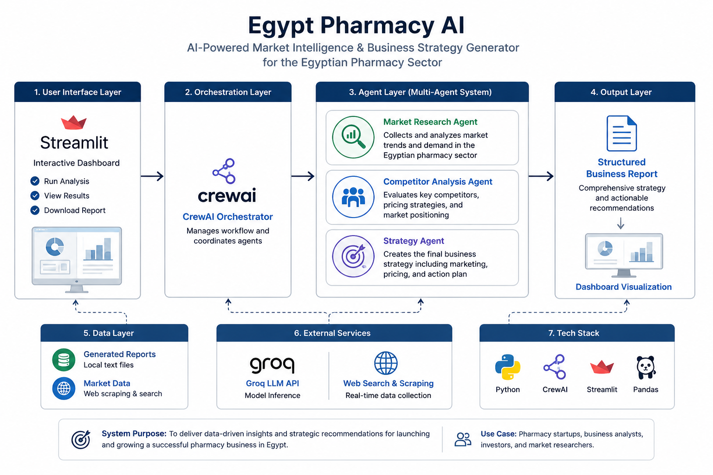

# Egypt Pharmacy AI

Egypt Pharmacy AI is a multi-agent business intelligence system designed to analyze the Egyptian pharmacy market and generate structured strategic insights for launching and scaling pharmacy businesses.

# Overview

This project simulates a real-world consulting pipeline powered by AI agents that perform market research, competitor analysis, and strategy generation.

The final output is presented through an interactive Streamlit dashboard and exported as a structured business report.

# System Architecture

The system is built on a layered AI pipeline:

User Interface Layer  
→ Streamlit dashboard for interaction and visualization

Orchestration Layer  
→ CrewAI coordinates multi-agent execution

Agent Layer  
→ Market Research Agent  
→ Competitor Analysis Agent  
→ Strategy Agent  

Output Layer  
→ Structured business report + dashboard insights  

Data & Services Layer  
→ Market data sources + Groq LLM API  

# Key Capabilities

- Automated market analysis for pharmacy sector in Egypt  
- Competitor benchmarking and pricing insights  
- Business strategy generation  
- Structured AI-generated reports  
- Interactive dashboard visualization  

# Tech Stack

- Python  
- CrewAI  
- Streamlit  
- Groq / LiteLLM  
- Pandas  
- Web scraping tools  

# Output

The system generates:

- Market analysis report  
- Competitive landscape insights  
- Pricing and positioning strategy  
- Go-to-market plan  
- Business recommendations  

# Purpose

This project demonstrates how multi-agent AI systems can simulate real consulting workflows and generate actionable business intelligence for startup ideas.

# Author

Doaa Salama